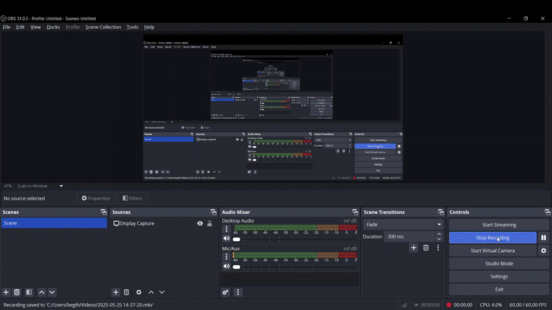

# Weather App 🌦️

A sleek and interactive Weather App built with HTML, CSS, and JavaScript! Check the weather for your location or any city with a modern, user-friendly design. Stay prepared for the day! ☀️🌧️

## 🎥 Demo

Play live [here](https://your-weather-app.netlify.app) or see the action below! 🎮  


## 🌟 Features

- **Your Weather** 📍: Get the current weather for your location with one click.
- **Search Weather** 🔍: Look up the weather for any city by name.
- **Detailed Info** ℹ️: Shows temperature, weather condition, wind speed, humidity, and cloudiness.
- **Responsive Design** 📱: Works beautifully on both mobile and desktop devices.
- **Modern UI** 🎨: Gradient background on mobile, with a clean card layout and icons.

## 📖 Preview

A stylish weather app to stay updated! 🌞

- **Tabs**: Switch between "Your Weather" and "Search Weather" tabs.
- **Location Access**: Prompts for location access to fetch your local weather.
- **Search Form**: Enter a city name to check its weather.
- **Weather Card**: Displays city name, country flag, temperature, weather icon, and more.
- **Styling**: Uses Flexbox for layout, with a monospace font and icons for wind, humidity, and clouds.

## 📂 Project Structure

```
WeatherApp/
- assets/               # Folder for images and icons 🖼️
  - cloud.png           # Icon for cloudiness
  - favicon.ico         # Favicon for the app
  - humidity.png        # Icon for humidity
  - loading.gif         # Loading animation
  - location.png        # Icon for location access
  - not-found.png       # Placeholder for errors
  - search.png          # Icon for search button
  - wind.png            # Icon for wind speed
- index.html            # Main HTML file 📄
- styles.css            # Styles for the app 🎨
- scripts.js            # Code for fetching and displaying weather data 🔧
- README.md             # Project documentation 📖
- LICENSE               # License file 📜
```

## 🚀 Setup Instructions

1. **Clone the Repository**:

   ```bash
   git clone https://github.com/root-kush369/weather-wise.git
   ```
2. **Navigate to the Project Directory**:

   ```bash
   cd weather-wise
   ```
3. **Get an API Key**:
   - Sign up at [OpenWeatherMap](https://openweathermap.org/) and get a free API key.
   - The API key is already included in `scripts.js` for local testing, but replace it with your own for production use.

4. **Open the App**:
   - Open `index.html` in a browser to check the weather! 🖥️

## 🛠️ Technologies Used

- **HTML5** 📄: Structured the app with tabs, forms, and weather cards.
- **CSS3** 🎨: Styled with Flexbox, gradients, and responsive design for all devices.
- **JavaScript** 🔧: Fetched weather data and updated the UI dynamically.

## 🔍 How It Works

- **Choose a Tab** 🌟: Select "Your Weather" or "Search Weather" to start.
- **Your Weather** 📍: Grant location access to see your local weather.
- **Search Weather** 🔍: Enter a city name to fetch its weather data.
- **View Results** 📊: See temperature, weather condition, wind speed, humidity, and more in a card.
- **Responsive UI** 📱: Adapts to any screen size with a gradient background on mobile.

## 📦 Deployment Tips

- **Run Locally**: Open `index.html` in a browser—no server needed.
- **Share Online**: Deploy to Netlify or GitHub Pages for a live demo link.
- **Optimize Performance**: Minify CSS and JS files for faster loading.

## 🤝 Contributing

Want to improve this app? Fork the repository, make your changes, and submit a pull request! 🌟

## 📜 License

This project is licensed under the MIT License - see the LICENSE file for details.

## 📬 Contact

Got questions or feedback? Reach out to me at [5kushbhardwaj7@gmail.com] or open an issue on GitHub. Let’s talk about coding! 💬

---

Built with ❤️ by Kush Sharma
